# 🚀 Harness CI/CD Repository with Full Security, Testing, and Cloud Integrations

This repository showcases **production-grade Harness CI/CD pipelines** for GKE deployments, implementing **shift-left DevSecOps** with comprehensive security scanning, automated testing, and multi-environment promotion. It aligns with enterprise standards for Pune product companies (GCC/healthcare/tech) targeting senior DevOps roles at 30+ LPA.

**Key Integrations:**
- **STO Orchestration**: SAST, DAST, IaC, secrets, container scans
- **Testing Stack**: Playwright, Selenium, unit/integration (CI-stage execution)
- **Security Tools**: ZAP, Gitleaks, Nexus IQ/RM, Aqua Trivy
- **Artifact Repos**: Nexus, GAR, GCS with policy gating
- **Secrets**: HashiCorp Vault + Harness secrets
- **Source/IDP**: GitHub + Backstage service catalog
- **IaC**: Terraform Cloud validation
- **Runtime**: GKE Autopilot + Istio service mesh

***

## 📦 Repository Structure

```
harness-cicd-repo/
│
├── pipelines/                   # Pipeline-as-Code YAMLs (CI/CD/STO)
│   ├── ci-build-scan-push.yaml  # Shift-left security + artifact promotion
│   ├── cd-gke-multi-env.yaml    # Blue-green/canary rollouts
│   └── sto-full-scan.yaml       # Orchestrated security pipeline
├── connectors/                  # Account/Project scoped connectors
│   ├── gcp-gar-gke.yaml
│   ├── nexus-iq-rm.yaml
│   ├── vault-secrets.yaml
│   └── aqua-trivy.yaml
├── delegates/                   # Immutable delegate manifests
│   ├── gke-autopilot-delegate.yaml
│   └── workload-identity.yaml   # OIDC auth [memory:51]
├── environments/                # Prod/Non-Prod with GitOps sync
│   ├── dev-gke.yaml
│   ├── staging-istio.yaml
│   └── prod-canary.yaml
├── sto/                         # Security test configs + policies
│   ├── sast-sonar.yaml
│   ├── dast-zap.yaml
│   └── iac-terraform.yaml
├── scripts/                     # Bash/Python helpers
│   ├── sbom-gen.py              # CycloneDX/Syft [memory:60]
│   └── drift-check.sh           # Terraform drift detection [memory:59]
├── .github/workflows/           # PR validation gates
└── docs/                        # Architecture diagrams + runbooks
    └── harness-certification.md [memory:58]
```

***

## 🔌 Connectors (Account/Project Scoped)

Connectors enable secure, credential-less integrations:

```yaml
# GCP GKE + Workload Identity (preferred over SA keys)
connectors:
  - name: gke-prod
    type: KubernetesCluster
    spec:
      credential:
        type: WorkloadIdentity  # OIDC federation [memory:51]
        spec:
          workloadIdentityProviderRef: gcp-oidc-provider
          serviceAccountRef: gke-sa
      clusterName: prod-gke-autopilot
      namespace: harness

  - name: gar-primary
    type: Gcr
    spec:
      serviceAccountKeyRef: gar-wi-sa  # Workload Identity

  - name: nexus-iq
    type: Nexus
    spec:
      nexusServerUrl: https://nexus.corp.com
      usernameRef: nexus-user
      passwordRef: nexus-token
      version: v2  # Nexus Repository Manager + IQ Server

  - name: vault-cluster
    type: HashiCorpVault
    spec:
      vaultUrl: https://vault.corp.com:8200
      auth:
        type: AppRole
        spec:
          appRoleSecretRef: vault-role-id
          appRoleIdRef: vault-role-secret
      secretEngine:
        type: KV
        version: v2
        path: secret/
```

**Pro Tip**: Use Harness Delegate selectors for environment-specific connector scoping.

***

## 🛠️ Delegates (Immutable + Auto-Scaling)

Deploy delegates as DaemonSets in GKE for low-latency execution:

```yaml
apiVersion: v1
kind: Namespace
metadata:
  name: harness-delegate
---
apiVersion: apps/v1
kind: DaemonSet
metadata:
  name: gke-delegate
  namespace: harness-delegate
spec:
  selector:
    matchLabels:
      app: harness-delegate
  template:
    spec:
      serviceAccountName: delegate-sa  # Workload Identity
      containers:
      - name: delegate
        image: harness/delegate:25.11.xx
        env:
        - name: HARNESS_DELEGATE_TOKEN
          valueFrom:
            secretKeyRef:
              name: delegate-token
              key: token
        resources:
          requests:
            cpu: 500m
            memory: 1Gi
```

***

## 🎯 Pipeline Stages (Shift-Left + GitOps)

**Unified Pipeline** with failure gates and promotion policies:

```yaml
pipeline:
  name: full-devsecops-pipeline
  templateRef: standard-ci-cd  # Reusable templates
  stages:
    - stage:
        name: CI-Build-Scan-Push
        type: CI
        spec:
          execution:
            steps:
              - stepGroup: BuildAndTest  # Parallel execution
                steps:
                  - step: { type: Run, name: MavenBuild, command: "mvn clean package" }
                  - parallel:
                    - step: { type: Test, name: JUnit, reports: junit.xml }
                    - step: { type: PlaywrightTest, config: playwright.config.js }  # CI-stage UI tests
              - stepGroup: ShiftLeftSecurity  # Parallel scans
                steps:
                  - parallel:
                    - step: { type: SAST, config: sonar-project.properties }
                    - step: { type: Gitleaks, pattern: "**/*.yaml,**/*.tf" }
                  - step: { type: AquaTrivy, image: localhost:5000/app:${BUILD_TAG} }
              - step: { type: NexusArtifactUpload, policyCheck: true }  # IQ gate

    - stage:
        name: CD-Dev
        type: CD
        spec:
          deploymentType: Kubernetes
          service: my-app-service
          environment:
            environmentRef: dev
            deployConfig: direct  # RollingUpdate
          execution:
            steps:
              - step: { type: K8sDeploy, skipDryRun: false }
              - step: { type: K8sVerify, service: my-app }  # Harness Verification

    - stage:
        name: CD-Staging
        type: CD
        spec:
          execution:
            steps:
              - step: { type: Approval, type: Harness }
              - step: { type: Canary, analysis: chaos }  # Progressive delivery
              - step: { type: ZAPScan, target: https://staging.app.com }  # Post-deploy DAST

    - stage:
        name: Promote-Prod
        type: Apply
        spec:
          steps:
            - step: { type: TerraformPlan, path: ./iac/prod }
            - step: { type: Approval, type: JIRA }  # External gates
```

***

## 🌐 Environments + Promotion Policies

```yaml
environment:
  name: prod
  type: Production
  tags:
    env: prod
    compliance: pci-dss
  infrastructureDefinitions:
    - name: prod-gke-eastus
      type: KubernetesGcp
      spec:
        clusterConnectorRef: gke-prod
        namespace: prod
        releaseName: app-${git.commit.sha}
  deploymentType: Kubernetes
  allowNonErgasticPerm: false
```

**Promotion Flow**: Dev → Staging (auto) → Prod (manual + policy evaluation)

***

## 🔒 STO Security Matrix

| Scan Type | Stage | Tool | Target | Gate |
|-----------|-------|------|--------|------|
| SAST | CI | SonarQube/Bandit | Source Code | Critical |
| Secrets | CI | Gitleaks | Repo/Configs | Block |
| IaC | CI | Checkov/Terraform | `.tf`/YAML | High |
| SCA/SCS | CI | Nexus IQ | Dependencies | Policy |
| Container | CI | Aqua Trivy | Built Images | Critical |
| DAST | CD (Post) | OWASP ZAP | Running App | Medium  |
| SBOM | CI/CD | Syft/Cosign | Artifacts | Policy  |

***

## 8️⃣ Updated CI/CD Flow Diagram

```mermaid
flowchart TD
    classDef git fill:#f0f0f0,stroke:#333,color:#000
    classDef ci fill:#cce5ff,stroke:#004085,color:#003366
    classDef test fill:#d4edda,stroke:#155724,color:#0f3e1f
    classDef deploy fill:#fff3cd,stroke:#856404,color:#5a4400
    classDef sto fill:#f8d7da,stroke:#721c24,color:#721c24
    classDef artifact fill:#e2e3e5,stroke:#6c757d,color:#343a40
    classDef delegate fill:#d6d8d9,stroke:#495057,color:#212529

    A[GitHub PR/MR]:::git --> B[Harness CI<br/>Build/Test/Scan]:::ci
    B --> C[Parallel:<br/>• Unit/Playwright<br/>• SAST/Gitleaks<br/>• IaC Checkov]:::test
    C --> D[Aqua Trivy<br/>Container Scan]:::sto
    D --> E[Nexus IQ Policy Gate<br/>Push GAR/Nexus]:::artifact
    E --> F[CD Dev → GKE Delegate]:::deploy
    F --> G[Rolling Deploy + Verify]:::delegate
    G --> H[DAST ZAP + Canary Analysis<br/>Staging]:::sto
    H --> I[Manual + Compliance Gate<br/>→ Production]:::deploy
```



***

## ✅ Enterprise Best Practices

- **Immutable Delegates** with Workload Identity (no long-lived creds)
- **Policy-as-Code** via Open Policy Agent (OPA) integration
- **GitOps Promotion** (ArgoCD/Flux sync post-Harness approval)
- **Chaos Engineering** gates for resilience
- **SBOM Generation** + SLSA compliance
- **Cost Optimization**: Spot VM pools for CI, Autopilot GKE for CD
- **Observability**: Harness CV + Prometheus/Grafana

***

## 📚 Additional Resources

- [Harness Developer Hub](https://developer.harness.io)[1]
- [GKE Harness Quickstart](https://developer.harness.io/docs/continuous-delivery/cd-tutorials/gar-gke-pipeline)[2]
- [STO Best Practices](https://developer.harness.io/docs/security-testing-orchestration)[3]
